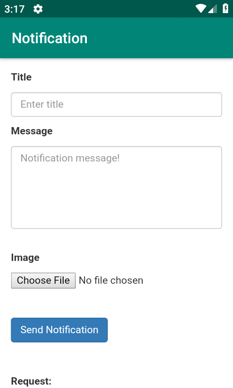

# FirebaseNotification
The Firebase Cloud Messaging Android Quickstart app demonstrates registering an Android app for notifications and handling the receipt of a message. InstanceID allows easy registration while FirebaseMessagingService and FirebaseInstanceIDService enable token refreshes and message handling on the client.

<a href="https://android-devlopersworld.000webhostapp.com/firebase/index.php">Demo</a>

